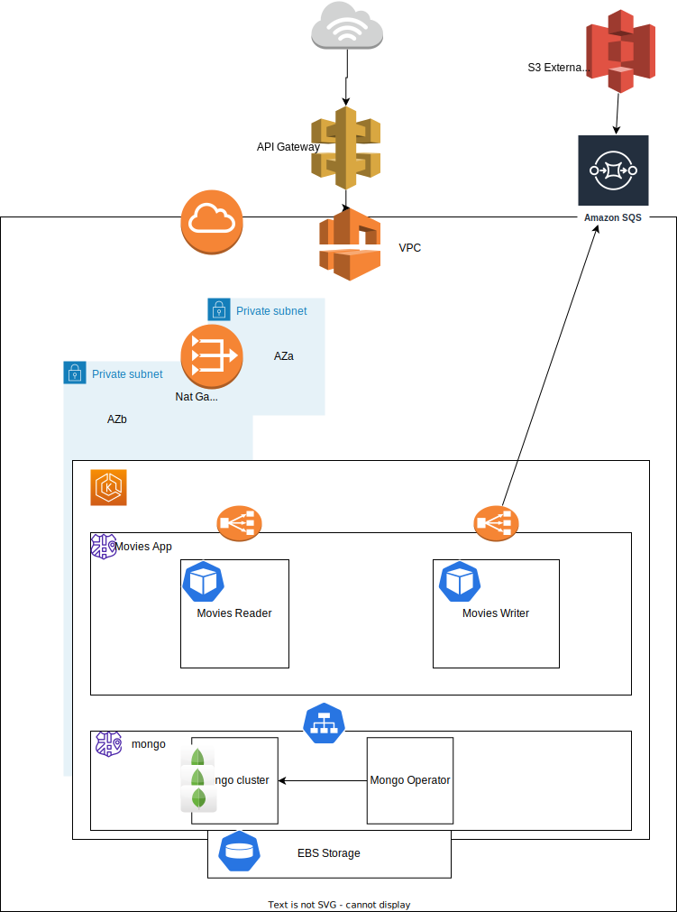
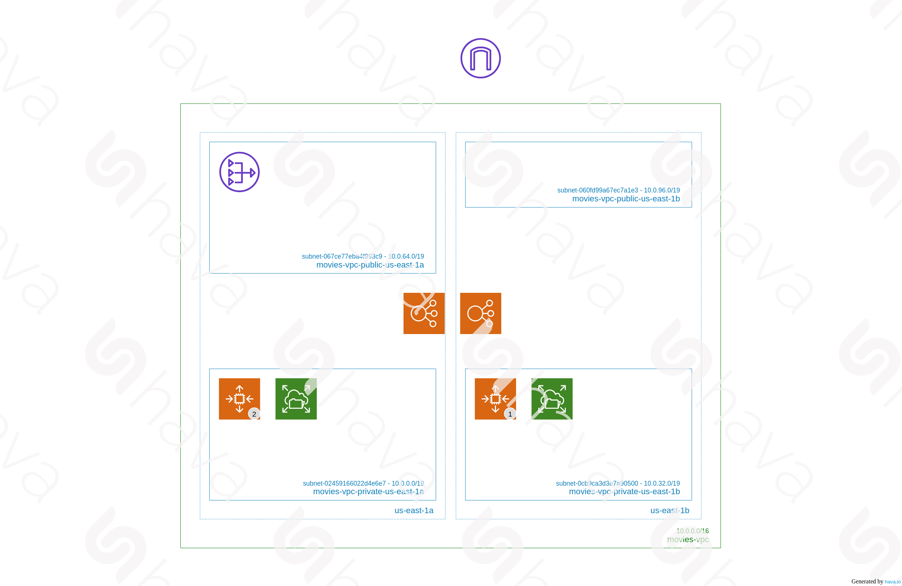

## The API
The endpoint: https://1uf7awebzk.execute-api.us-east-1.amazonaws.com/reader/api/v0/movies

*Produces*: application/json

*Example Output*: 
```
{
    "results": [
        {
            "id": "63c053d3bd91411b8177c38d",
            "title": "Harry Potter",
            "year": 2002,
            "cast": [
                "Daniel Radcliffe",
                "Emma Watson"
            ],
            "genres": [
                "Fantasy"
            ]
        },
        {
            "id": "63c053d4bd91411b8177c38e",
            "title": "Top Gun",
            "year": 1989,
            "cast": [
                "Tom Cruise"
            ],
            "genres": [
                "Action"
            ]
        }
    ],
    "pageData": {
        "offSet": 0,
        "pageSize": 2
    }
}
```

*Optional Parameters*: 
| Parameter        | Description               | Defaults  |
| -------------    |:-------------------------------------------------------------------------------------:            | -----:    |
| title            | the title to query by     | null      |
| cast             | single member to query by | null      |
| year             | year can be any number. if it is an invalid year it will simply return an empty response           | null      |
| genre            | single genre string       | null      |
| offset           | for paging -> the first record by number that we want to fetch                                     | 0      |
| limit             | for paging -> expected number of records per page                                                 | 50      |

*Example queries*:
By title and genre: https://1uf7awebzk.execute-api.us-east-1.amazonaws.com/reader/api/v0/movies?title="Harry Potter"&genre="Fantasy"
For paging: https://1uf7awebzk.execute-api.us-east-1.amazonaws.com/reader/api/v0/movies?limit=30&offset=31

## Notifications from S3
As a part of the requirements, this app also supports writing changes based on updates to an S3 Bucket. The flow would be something like this:

- Upload a file to the right s3 bucket.
- S3 sends out a SQS notification
- The movies-writer app polls for this notification and updates the mongo database accordingly.
The writer app is a simple sqs to mongo translator, it does not validate/reconcile duplicate movies, or invalid records as of yet.

To try this flow out, please use the credentials provided to upload a file to an s3 bucket. For example,
```
 aws s3 cp sample-s3-upload.json s3://svasant-movies-bucket/
```
Please create a new file similar to the sample-s3-upload mentioned in the example above. The writer accepts both Json Arrays and Json Objects.

## Deploying To AWS
Tools required: awscli, kubectl, eksctl, terraform, bash
Credentials: aws configure -> with account id and secret key

1. Deploy the VPC: This will create the VPC, the EKS cluster, and all the associated networking components
```
cd infrastructure/terraform/vpc
terraform init
terraform apply
cd ../..
```
Ensure you copy the vpc_id and private subnet_ids from the output.
2. Deploy mongo: This will deploy MongoDB community version 4.2.6 as a StatefulSet deployment in the mongodb namespace. It uses the mongodbcommunity operator and mongodbcommunity resource to create the deployments. The complexities around handling persistent volumes are handled by the EBS CI controller and the mongodbcommunity operator. It also creates the user accounts and credentials that we could use.
```
cd infrastructure/mongodb
./deploy-mongo.sh <preferredAdminPassword> <preferredMovieAppPassword>
cd ../..
```

3. Deploy the Reader App(the API): this is a standard kubernetes deployment using a private LoadBalancer.
```
cd apps/reader
./deploy-reader.sh
cd ../..
```

4. Go to the AWS console > Load Balancers. Select the load balancer created for our deployment above. Click on listeners and copy the listener arn.
5. Update api-gateway.tfvars with the correct vpc-id and private subnet ids from step 1, and the listener arn from step 4.
6. Deploy the API gateway 
```
cd infrastructure/terraform/api-gateway
terraform init
terraform apply
cd ../../..
```
This should output the URL from where we can now access the movies app.
7. Deploy the S3 and event notifications infra
```
cd infrastruture/terraform/s3-notifications
terraform init
terraform apply
cd ../../..
```
8. Deploy the writer app 
```
cd apps/writer
./deploy-writer.sh
```
I wanted to use service-accounts for this but I ran out of time.

## Deploying to minikube locally

This app only supports steps 2 and 3 locally. I haven't tried out the writer locally, all the testing for that was on the EKS cluster. However by passing by using `./deploy-writer.sh <aws_access_key> <aws_secret_key>` once, you should be able to run the writer locally as well.

## Code Structure

This repo has two apps. One that serves the movies api, and the other that polls for events and writes to the mongo database. I separated the two concerns so that we can potentially scale them separately. We could also potentially point the readers to talk to the secondaries exclusively, to improve performance. 
As for the apps, they are both spring-boot apps using java 17. Since they share the same models and repositories, I moved the DTO into a separate libs directory. Both apps pull this in as gradle dependencies.
The apps are built using gradle and run as docker containers. I use spring-boots gradle commands to dockerize these apps for simplicity. 

## Architecture



I am sorry the diagrams aren't too neat. I used draw.io and for some reason it didn't let me move or even remove the subnet az_a part of the diagram.

I have also generated a diagram using hava.io, which visualizes the actual VPC. 


## Data Architecture

I used mongodb as the document store. Each attribute is indexed. Since we don't have a specific query pattern, I indexed each attributed individually. While querying we use the part of the query that hits the index with the highest cardinality to improve query times.

A further extension would be to use an in-memory datastore, like Redis, that would make queries much faster.

## Notes

I had to write most of the code in Windows unfortunately, although I build it using WSL2. If you are running this locally and notice the bash scripts failing, please open the scripts in your preferred editor and instruct it to convert the line returns from CRLF to LF.

## Referred Material
- https://registry.terraform.io/providers/hashicorp/aws/latest/docs/resources/s3_bucket_notification event notifications
- https://github.com/mongodb/mongodb-kubernetes-operator/blob/master/docs for MongoDB Community deployments
- https://antonputra.com/amazon/Integrate-amazon-api-gateway-with-amazon-eks for the architecture in aws, and help around api gateways
